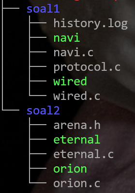
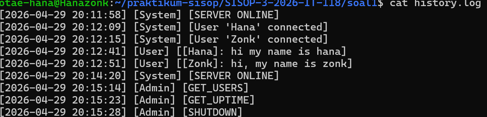
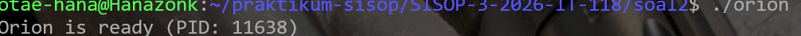
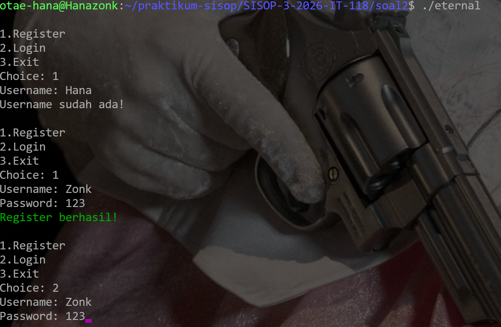

# Modul 3 Thread, IPC, & RPC
---

Nama: Pradipta Airlangga Ramadhan

NRP: 5027251118

Departemen: Teknologi Informasi
---

# Tree

---

## Soal 1 - Present Day, Present Time
Author: YASY / xcaired

### Penjelasaan Soal
Soal ini meminta pembuatan sistem komunikasi jaringan berbasis Socket Programming menggunakan bahasa C. Sistem terdiri dari sebuah server bernama The Wired (wired.c) dan sebuah client bernama NAVI (navi.c), dengan fungsi logging komunikasi di protocol.c.

### Penjelasan Kode
#### A. Protocol.c
File ini berisi dua fungsi utilitas yang digunakan oleh server (wired.c).

```c
#include <stdio.h>
#include <string.h>
#include <time.h>
#include <unistd.h>
#define MAX_CLIENTS 10

extern int clients[MAX_CLIENTS];
```
extern int clients[] — merujuk ke array clients yang didefinisikan di wired.c. Kata kunci extern memungkinkan file ini mengakses variabel dari file lain tanpa mendefinisikan ulang.

- Fungsi log_message
```c
void log_message(char *type, char *msg) {
    FILE *f = fopen("history.log", "a");
    time_t t = time(NULL);
    struct tm tm = *localtime(&t);
    fprintf(f, "[%04d-%02d-%02d %02d:%02d:%02d] [%s] [%s]\n",
        tm.tm_year+1900, tm.tm_mon+1, tm.tm_mday,
        tm.tm_hour, tm.tm_min, tm.tm_sec, type, msg);
    fclose(f);
}
```
Penjelasan tiap baris: 
1. fopen("history.log", "a"): Buka file log dalam mode append agar log lama tidak tertimpa 
2. time (NULL): Ambil waktu sistem saat ini dalam bentuk Unix timestamp
3. *localtime(&t): Konversi timestamp ke struct tm yang berisi tahun, bulan, hari, jam, menit, detiktm
4. .tm_year+1900: Tahun di struct tm dihitung dari 1900, jadi perlu ditambah 1900tm.
5. tm_mon+1Bulan: di struct tm dimulai dari 0 (Januari=0), jadi perlu ditambah 1
6. fprintf(): Tulis satu baris log ke file dengan format lengkap
7. fclose(f): Tutup file setelah selesai menulis

- Fungsi broadcast
```c
void broadcast(char *msg, int sender) {
    for (int i = 0; i < MAX_CLIENTS; i++) {
        if (clients[i] != 0 && clients[i] != sender) {
            send(clients[i], msg, strlen(msg), 0);
        }
    }
}
```
Penjelasan tiap baris:
1. for (int i = 0; i < MAX_CLIENTS; i++): Iterasi semua slot client yang tersedia
2. clients[i] != 0: Slot tidak kosong (ada client terhubung)
3. clients[i] != sender: Jangan kirim balik ke pengirim pesansend
4. (clients[i], msg, strlen(msg), 0): Kirim pesan ke client tersebut melalui socket-nya

#### B. wired.c (Server)
Variabel Global
```c
int clients[MAX_CLIENTS];
char names[MAX_CLIENTS][50];
int total_clients = 0;
time_t start_time;
```

Penjelasan tiap baris: 
1. clients[]Menyimpan file descriptor socket setiap client. Nilai 0 berarti slot kosong.

2. names[][]Menyimpan nama setiap client sesuai index yang sama dengan clients[]

3. total_clientsJumlah client yang sedang terhubung

4. start_timeWaktu server mulai berjalan, digunakan untuk menghitung uptime

- Fungsi handle_client

Fungsi ini dijalankan di thread terpisah untuk setiap client yang terhubung.
```c
void *handle_client(void *arg) {
    int sock = *(int*)arg;
    free(arg);
     recv(sock, name, sizeof(name), 0);
```

arg adalah pointer ke integer (socket fd) yang dialokasikan dengan malloc di main. Di-cast ke int* lalu di-free untuk mencegah memory leak.

```c
recv(sock, name, sizeof(name), 0);
```
Menerima nama yang dikirim client pertama kali saat connect.

```c
for (int i = 0; i < MAX_CLIENTS; i++) {
        if (clients[i] == 0) {
            int dup = 0;
            for (int j = 0; j < MAX_CLIENTS; j++) {
                if (strcmp(names[j], name) == 0) dup = 1;
            }
            if (dup) {
                send(sock, "[System] Name used\n", 20, 0);
                close(sock);
                return NULL;
            }
            clients[i] = sock;
            strcpy(names[i], name);
            idx = i;
            total_clients++;
            break;
        }
    }
```
Cari slot kosong di array clients. Sebelum mendaftarkan, cek dulu apakah nama sudah dipakai (poin 4 soal). Jika duplikat, client langsung ditolak dan koneksi ditutup.

```c
if (strcmp(name, "The_Knights") == 0) {
        send(sock, "[Admin Mode]\n", 13, 0);
        while (1) {
            // tampilkan menu admin
            int cmd = atoi(buffer);
            if (cmd == 1) { /* GET_USERS */ }
            else if (cmd == 2) { /* GET_UPTIME */ }
            else if (cmd == 3) { /* SHUTDOWN */ exit(0); }
            else break;
        }
        close(sock);
        return NULL;
    }
```

Jika nama client adalah "The_Knights", masuk ke mode admin (RPC). Admin bisa melihat jumlah user aktif, uptime server, atau mematikan server.

```c
while (1) {
        int len = recv(sock, buffer, BUFFER_SIZE, 0);
        if (len <= 0) break;
        buffer[len] = 0;
        if (strcmp(buffer, "/exit") == 0) break;
        char msg[1100];
        sprintf(msg, "[%s]: %s", name, buffer);
        log_message("User", msg);
        broadcast(msg, sock);
    }
```

Loop utama menerima pesan dari client. Jika client mengirim /exit atau koneksi terputus (len <= 0), loop berhenti. Setiap pesan chat diformat lalu di-broadcast ke semua client lain dan dicatat ke log.

```c
clients[idx] = 0;
    total_clients--;
    close(sock);
```

Bersihkan slot setelah client disconnect: kosongkan entry di array, kurangi counter, tutup socket.

### C. Fungsi main (Server)
```c
start_time = time(NULL);
log_message("System", "SERVER ONLINE");
server_fd = socket(AF_INET, SOCK_STREAM, 0);
addr.sin_family = AF_INET;
addr.sin_addr.s_addr = INADDR_ANY;
addr.sin_port = htons(PORT);
bind(server_fd, (struct sockaddr*)&addr, sizeof(addr));
listen(server_fd, 5);
```

Penjelasan tiap baris: 
1. socket(AF_INET,SOCK_STREAM,0): Buat socket TCP/IPv4

2. INADDR_ANY: Terima koneksi dari semua interface jaringan

3. htons(PORT): Konversi port ke format network byte order (big-endian)

4. bind(): Kaitkan socket ke alamat dan port

5. listen(): Mulai mendengarkan koneksi, maksimal 5 antrian

```c
while (1) {
        new_socket = accept(server_fd, (struct sockaddr*)&addr, (socklen_t*)&addrlen);
        pthread_t t;
        int *p = malloc(sizeof(int));
        *p = new_socket;
        pthread_create(&t, NULL, handle_client, p);
    }
```

1. accept(): Terima koneksi baru dari client, mengembalikan socket fd baru

2. malloc(sizeof(int)): Alokasi memori untuk menyimpan socket fd agar aman dikirim ke thread

3. pthread_create(): Buat thread baru yang menjalankan handle_client untuk setiap client

Dengan pola ini, server dapat melayani banyak client secara bersamaan — setiap client punya thread sendiri. Inilah yang membuat server skalabel sesuai poin 3 soal.

#### D. navi.c (Client)
- Fungsi receive_msg (Thread Penerima)
```c
void *receive_msg(void *arg) {
    char buffer[BUFFER_SIZE];
    while (1) {
        int len = recv(sock, buffer, BUFFER_SIZE, 0);
        if (len <= 0) break;
        buffer[len] = 0;
        printf("%s\n", buffer);
    }
    return NULL;
}
```

1. recv(sock, buffer, BUFFER_SIZE, 0): Terima data dari server, fungsi ini blocking (menunggu sampai ada data)

2. if (len <= 0) break: Jika server menutup koneksi, keluar dari loop

3. buffer[len] = 0: Tambahkan null terminator agar string valid

4. printf("%s\n", buffer):
Tampilkan pesan yang diterima dari server

Fungsi ini berjalan di thread terpisah sehingga client bisa menerima pesan dari server sambil tetap menerima input tanpa fork.

#### E. Fungsi main (Client)
```c
start_time = time(NULL);
log_message("System", "SERVER ONLINE");
server_fd = socket(AF_INET, SOCK_STREAM, 0);
addr.sin_family = AF_INET;
addr.sin_addr.s_addr = INADDR_ANY;
addr.sin_port = htons(PORT);
bind(server_fd, (struct sockaddr*)&addr, sizeof(addr));
listen(server_fd, 5);
```
Membuat socket dan menghubungkan ke server di 127.0.0.1:8080. inet_addr() mengkonversi string IP menjadi format binary.

```c
printf("Enter your name: ");
fgets(buffer, 50, stdin);
buffer[strcspn(buffer, "\n")] = 0;
send(sock, buffer, strlen(buffer), 0);
```
Meminta nama pengguna, menghapus newline di akhir dengan strcspn, lalu mengirim nama ke server sebagai langkah registrasi pertama.

```c
pthread_t t;
pthread_create(&t, NULL, receive_msg, NULL);
```
Membuat thread khusus untuk menerima pesan dari server. Thread ini berjalan paralel dengan loop input di bawah.

```c
while (1) {
    fgets(buffer, BUFFER_SIZE, stdin);
    buffer[strcspn(buffer, "\n")] = 0;
    send(sock, buffer, strlen(buffer), 0);
    if (strcmp(buffer, "/exit") == 0) break;
}
close(sock);
```
Loop utama membaca input dari keyboard dan mengirimkan ke server. Jika user mengetik /exit, loop berhenti dan socket ditutup.

### Compiler dan Menjalankan
Compiler server

```gcc -o wired wired.c protocol.c -lpthread```

Compiler client

```gcc -o navi navi.c -lpthread```

Terminal 1

`./wired`

Terminal 2

` ./navi `

Terminal 3

`./navi `

### Input dan Output




## Soal 2 - The Battle of Eterion
Author: ROOT

### Penjelasan Soal

Soal ini meminta pembuatan sistem permainan berbasis IPC (Inter-Process Communication) menggunakan bahasa C. Sistem terdiri dari sebuah server bernama Orion (orion.c) dan sebuah client bernama Eternal (eternal.c), dengan konfigurasi bersama di arena.h.

### Penjelasan Code

#### A. Makefile
```c
CC = gcc
CFLAGS = -Wall -pthread
LDFLAGS = -lrt

all: server client

server: orion.c arena.h
    $(CC) $(CFLAGS) orion.c -o orion $(LDFLAGS)

client: eternal.c arena.h
    $(CC) $(CFLAGS) eternal.c -o eternal $(LDFLAGS)

clean:
    rm -f orion eternal

clear_ipc:
    ipcs -m | grep 0x00001234 | awk '{print $$2}' | xargs -r ipcrm -m
    ipcs -q | grep 0x00005678 | awk '{print $$2}' | xargs -r ipcrm -q
    ipcs -s | grep 0x00009012 | awk '{print $$2}' | xargs -r ipcrm -s
```
clear_ipc digunakan untuk membersihkan shared memory, message queue, dan semaphore yang tertinggal di sistem setelah program selesai berjalan.

#### B. arena.h
File header yang mendefinisikan semua tipe data dan konstanta yang digunakan bersama oleh orion.c dan eternal.c.

```c
#ifndef ARENA_H
#define ARENA_H
#include <pthread.h>
#define MAX_PLAYER 10
#define MAX_HISTORY 10
```
Guard #ifndef mencegah file ini di-include lebih dari sekali. MAX_PLAYER dan MAX_HISTORY adalah batas maksimum pemain dan riwayat pertandingan.

```c
typedef struct {
    char opponent[50];
    char result[10];
    int xp;
} History;
```
Struct History menyimpan satu riwayat pertandingan: nama lawan, hasil (WIN/LOSS), dan XP yang didapat.

```c
typedef struct {
    char username[50];
    char password[50];
    int level;
    int gold;
    int xp;
    int base_damage;
    int weapon_damage;
    int health;
    int in_battle;
    int active;
    History history[MAX_HISTORY];
    int hcount;
} Player;
```
Penjelasan tiap baris:
1. username, password: Identitas pemain untuk login

2. level, gold, xp: Statistik pemain

3. base_damage, weapon_damage: Damage dasar dan bonus dari senjata

4. health: Poin kesehatan pemain

5. in_battle: Flag: 1 jika sedang bertarung (tidak bisa di-matchmaking)

6. active: Flag: 1 jika sedang login (tidak bisa login di sesi lain)

7. history[], hcount: Array riwayat pertandingan dan jumlahnya

```c
typedef struct {
    Player players[MAX_PLAYER];
    int count;
    int waiting_player;
    pthread_mutex_t lock;
} SharedData;
```
Penjelasan tiap baris:
1. players[]: Array semua pemain terdaftar

2. count: Jumlah pemain yang sudah terdaftar

3. waiting_player: Index pemain yang sedang menunggu lawan di matchmaking (-1 jika tidak ada)

4. lock: Mutex untuk mencegah race condition saat mengakses shared memory

#### C. orion.c (server)
```c
int main() {
    key_t key = 1234;
    int shmid = shmget(key, sizeof(SharedData), 0666 | IPC_CREAT);
```
shmget() membuat atau mengakses shared memory dengan key 1234. Flag IPC_CREAT berarti buat baru jika belum ada. 0666 adalah permission (read+write untuk semua).

```c
SharedData *data = (SharedData*) shmat(shmid, NULL, 0);
```
shmat() melampirkan shared memory ke address space proses ini. Hasilnya adalah pointer ke SharedData yang bisa langsung diakses.

```c
data->count = 0;
    data->waiting_player = -1;
    pthread_mutex_init(&data->lock, NULL);
```
Inisialisasi nilai awal: belum ada pemain terdaftar, tidak ada yang menunggu matchmaking, dan mutex siap digunakan.

```c
printf("Orion is ready (PID: %d)\n", getpid());
    while (1) {
        sleep(5);
    }
```
Orion mencetak PID-nya agar diketahui, lalu berjalan terus dalam loop tak terbatas. Tugasnya hanya menjaga shared memory tetap hidup selama Eternal-Eternal berjalan.

#### D. eternal.c (Client)
- Variabel Global
```c
SharedData *data;
int login_idx = -1; 
```
data adalah pointer ke shared memory yang sama dengan yang dibuat Orion. login_idx menyimpan index pemain yang sedang login (-1 jika belum login).

- Fungsi hp_bar
```c
void hp_bar(int hp) {
    int total = 20;
    int fill = (hp * total) / 100;
    printf("[");
    for(int i=0;i<total;i++){
        if(i<fill) printf("█");
        else printf(" ");
    }
    printf("] %d\n", hp);
}
```
Menampilkan health bar visual dengan 20 blok. fill dihitung proporsional terhadap HP saat ini dibanding 100. Blok yang terisi mewakili HP yang tersisa.

- Fungsi profile
```c
void profile(Player p){
    printf("Name  : %s\n", p.username);
    printf("Lv    : %d\n", p.level);
    printf("Gold  : %d\n", p.gold);
    printf("XP    : %d\n", p.xp);
}
```
Menampilkan informasi statistik pemain yang sedang login.

- Fungsi register_user
```c
void register_user(){
    Player p;
    printf("Username: ");
    scanf("%s", p.username);
    pthread_mutex_lock(&data->lock);
    for(int i=0;i<data->count;i++){
        if(strcmp(data->players[i].username,p.username)==0){
            printf("Username sudah ada!\n");
            pthread_mutex_unlock(&data->lock);
            return;
        }
    }
```

Penjelasan tiap baris:
1. pthread_mutex_lock(&data->lock): Kunci mutex sebelum mengakses shared memory untuk mencegah race condition

2. pthread_mutex_unlock(): Buka kunci jika username sudah ada, lalu return

```c
p.level = 1; p.gold = 150; p.xp = 0;
    p.base_damage = 10; p.weapon_damage = 0;
    p.health = 100; p.active = 0; p.in_battle = 0; p.hcount = 0;
    data->players[data->count++] = p;
    pthread_mutex_unlock(&data->lock);
```
Set nilai default pemain baru sesuai soal (Gold=150, Lvl=1, XP=0), simpan ke shared memory, tambah counter, lalu buka mutex.

- Fungsi login_user
```c
void login_user(){
    for(int i=0;i<data->count;i++){
        if(strcmp(data->players[i].username,u)==0 &&
           strcmp(data->players[i].password,p)==0){
            login_idx = i;
            data->players[i].active = 1;
            printf("Login berhasil!\n");
            return;
        }
    }
    printf("Login gagal!\n");
}
```
Cari kombinasi username+password yang cocok di shared memory. Jika ditemukan, simpan index ke login_idx dan tandai pemain sebagai aktif (active=1). Flag active mencegah login di sesi lain secara bersamaan.

- Fungsi armory
```c
void armory(){
    Player *p = &data->players[login_idx];
    printf("1. Wood Sword (+10) - 100\n");
    printf("2. Iron Sword (+15) - 200\n");
    printf("3. Steel Axe (+30) - 300\n");
    int c; scanf("%d",&c);
    if(c==1 && p->gold>=100){ p->weapon_damage=10; p->gold-=100;}
    else if(c==2 && p->gold>=200){ p->weapon_damage=15; p->gold-=200;}
    else if(c==3 && p->gold>=300){ p->weapon_damage=30; p->gold-=300;}
}
```
Pemain bisa membeli senjata jika gold mencukupi. weapon_damage langsung di-set ke nilai senjata yang dibeli (senjata baru otomatis menggantikan yang lama, sehingga yang aktif adalah yang terakhir dibeli).

- Fungsi show_history
```c
void show_history(){
    Player p = data->players[login_idx];
    for(int i=0;i<p.hcount;i++){
        printf("%s - %s +%d XP\n",
            p.history[i].opponent,
            p.history[i].result,
            p.history[i].xp);
    }
}
```
Menampilkan semua riwayat pertandingan dari array history[] yang tersimpan di data pemain.

- Fungsi battle
```c
void battle(){
    Player *p = &data->players[login_idx];
    int enemy_hp = 100;
    int player_hp = 100;
    int total_dmg = p->base_damage + p->weapon_damage;
```
Inisialisasi pertempuran. total_dmg adalah total damage pemain: base damage + bonus weapon.

```c
while(player_hp>0 && enemy_hp>0){
        system("clear");
        hp_bar(player_hp);
        hp_bar(enemy_hp);
        printf("\n[A] Attack  [U] Ultimate\n");
        char cmd; scanf(" %c",&cmd);

        if(cmd=='a' || cmd=='A'){
            enemy_hp -= total_dmg;
        }
        else if(cmd=='u' || cmd=='U'){
            enemy_hp -= total_dmg*3;
        }
        if(enemy_hp<=0) break;
        player_hp -= 8;
        sleep(1);
    }
```
Penjelasan tiap baris:
1. system("clear"): Bersihkan layar setiap giliran untuk tampilan realtime

2. hp_bar(): Tampilkan health bar pemain dan musuh

3. total_dmg: Attack biasa mengurangi HP musuh sebesar total damage

4. total_dmg*3: Ultimate mengurangi HP musuh 3x damage (sesuai formula soal: Total Damage * 3)

5. player_hp -= 8: Musuh balik menyerang pemain tiap giliran

6. sleep(1): Cooldown 1 detik sebelum bisa menyerang lagi (sesuai poin 7 soal)

```c
int win = player_hp>0;
    if(win){
        p->xp += 50; p->gold += 120;
        strcpy(p->history[p->hcount].result,"WIN");
        p->history[p->hcount].xp = 50;
    }else{
        p->xp += 15; p->gold += 30;
        strcpy(p->history[p->hcount].result,"LOSS");
        p->history[p->hcount].xp = 15;
    }
    strcpy(p->history[p->hcount].opponent,"musuko");
    p->hcount++;
    if(p->xp>=100){ p->level++; p->xp = 0; }
```

Level naik ketika XP mencapai kelipatan 100, dan XP direset ke 0 (bukan dikurangi). Riwayat pertandingan disimpan ke array history[].

- Fungsi main (Client)
```c
int main(){
    key_t key = 1234;
    int shmid = shmget(key, sizeof(SharedData), 0666);
    data = (SharedData*) shmat(shmid, NULL, 0);
```
Akses shared memory yang sudah dibuat oleh Orion menggunakan key yang sama (1234). Tanpa flag IPC_CREAT, jika Orion belum jalan maka shmget akan gagal.

```c
while(1){
        printf("\n1.Register\n2.Login\n3.Exit\nChoice: ");
        scanf("%d",&c);
        if(c==1) register_user();
        else if(c==2){
            login_user();
            if(login_idx!=-1){
                int m;
                while(1){
                    profile(data->players[login_idx]);
                    printf("\n1.Battle\n2.Armory\n3.History\n4.Logout\nChoice: ");
                    scanf("%d",&m);
                    if(m==1) battle();
                    else if(m==2) armory();
                    else if(m==3) show_history();
                    else break;
                }
            }
        }
        else break;
    }
}
```
Struktur menu bertingkat: menu utama (Register/Login/Exit) → setelah login masuk menu dalam (Battle/Armory/History/Logout). Memilih Logout (else break) mengembalikan ke menu utama.

### Compiler dan Menjalankan
Compile server

`gcc orion.c -o orion -lpthread`

Compile client

`gcc eternal.c -o eternal -lpthread`

Terminal 1

`./orion`

Terminal 2

`./eternal`

### Input dan Output




